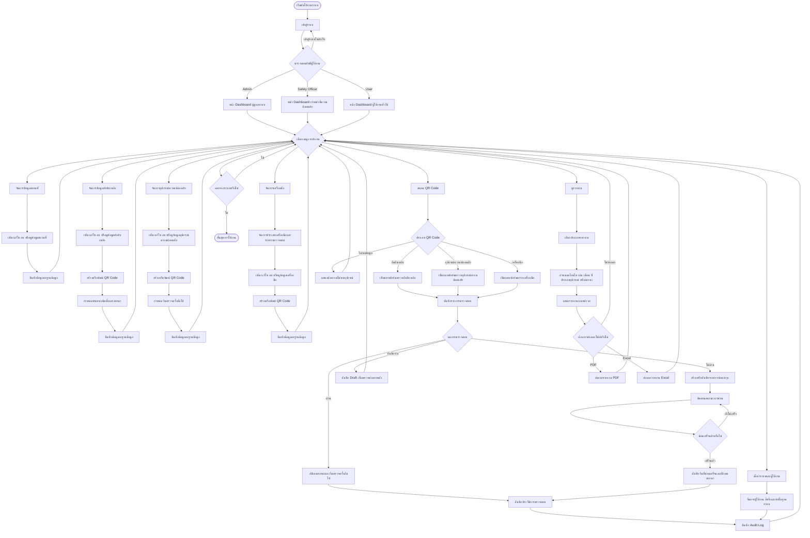
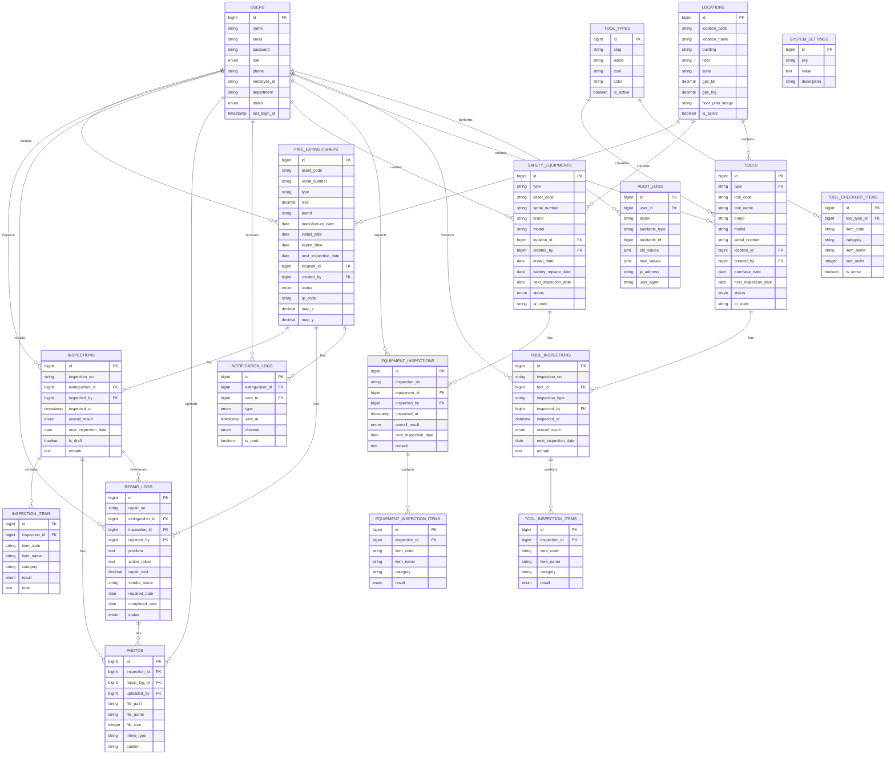

# CFARM FEM System

**CFARM FEM System** หรือ **Fire Extinguisher Management System** คือระบบเว็บแอปพลิเคชันสำหรับบริหารจัดการถังดับเพลิง อุปกรณ์ความปลอดภัย และเครื่องมือที่ต้องมีการตรวจสอบตามรอบภายในองค์กร ระบบช่วยจัดเก็บข้อมูลอุปกรณ์ ตำแหน่งติดตั้ง QR Code ประวัติการตรวจสอบ ประวัติการซ่อมบำรุง รายงาน และข้อมูลผู้ใช้งานตามสิทธิ์

ระบบนี้พัฒนาด้วย Laravel Framework และรองรับการติดตั้งผ่าน Docker เพื่อให้ง่ายต่อการใช้งานจริงบนเครื่องแม่ข่ายหรือสภาพแวดล้อม Production

## สารบัญ

- [ภาพรวมโครงการ](#ภาพรวมโครงการ)
- [หลักการและเหตุผล](#หลักการและเหตุผล)
- [วัตถุประสงค์](#วัตถุประสงค์)
- [ขอบเขตโครงการ](#ขอบเขตโครงการ)
- [ฟีเจอร์หลักของระบบ](#ฟีเจอร์หลักของระบบ)
- [บทบาทผู้ใช้งาน](#บทบาทผู้ใช้งาน)
- [เทคโนโลยีที่ใช้](#เทคโนโลยีที่ใช้)
- [โครงสร้างระบบโดยรวม](#โครงสร้างระบบโดยรวม)
- [การติดตั้งและใช้งาน](#การติดตั้งและใช้งาน)
- [คำสั่งที่ใช้งานบ่อย](#คำสั่งที่ใช้งานบ่อย)
- [Flowchart การทำงานของระบบ](#flowchart-การทำงานของระบบ)
- [ER Diagram](#er-diagram)
- [ประโยชน์ที่คาดว่าจะได้รับ](#ประโยชน์ที่คาดว่าจะได้รับ)

## ภาพรวมโครงการ

CFARM FEM System ถูกออกแบบมาเพื่อช่วยให้การจัดการอุปกรณ์ด้านความปลอดภัยมีความเป็นระบบ ลดการใช้เอกสารกระดาษ และช่วยให้เจ้าหน้าที่สามารถตรวจสอบข้อมูลได้อย่างรวดเร็วผ่าน QR Code โดยระบบรองรับอุปกรณ์หลัก 3 กลุ่ม ได้แก่

1. ถังดับเพลิง
2. อุปกรณ์ความปลอดภัย เช่น ไฟฉุกเฉิน และอ่างล้างตา/ฝักบัวฉุกเฉิน
3. เครื่องมือหรืออุปกรณ์ปฏิบัติงาน เช่น สว่านไฟฟ้า เครื่องเจียร เครื่องตัดไฟเบอร์ และเครื่องมืออื่น ๆ

ระบบสามารถใช้ติดตามข้อมูลสำคัญ เช่น รหัสทรัพย์สิน Serial Number ประเภทอุปกรณ์ ตำแหน่งติดตั้ง สถานะ วันติดตั้ง วันหมดอายุ วันตรวจครั้งถัดไป ผลการตรวจสอบ รายการซ่อมบำรุง และรายงานสรุปในรูปแบบ PDF หรือ Excel

## หลักการและเหตุผล

การบริหารจัดการถังดับเพลิงและอุปกรณ์ความปลอดภัยเป็นกระบวนการสำคัญขององค์กร เนื่องจากอุปกรณ์เหล่านี้ต้องพร้อมใช้งานอยู่เสมอในกรณีฉุกเฉิน หากขาดการตรวจสอบตามรอบ ข้อมูลไม่เป็นปัจจุบัน หรือไม่สามารถติดตามประวัติการซ่อมบำรุงได้ อาจทำให้เกิดความเสี่ยงต่อความปลอดภัยของพนักงาน ทรัพย์สิน และกระบวนการทำงานขององค์กร

เดิมการจัดเก็บข้อมูลมักอยู่ในรูปแบบเอกสารหรือไฟล์ตารางข้อมูล ซึ่งมีข้อจำกัดหลายด้าน เช่น ค้นหาข้อมูลยาก ตรวจสอบย้อนหลังไม่สะดวก ข้อมูลซ้ำซ้อน สูญหายได้ง่าย และไม่สามารถเชื่อมโยงข้อมูลอุปกรณ์กับประวัติการตรวจสอบหรือการซ่อมบำรุงได้อย่างครบถ้วน

ดังนั้น CFARM FEM System จึงถูกพัฒนาขึ้นเพื่อเปลี่ยนกระบวนการจัดการอุปกรณ์ความปลอดภัยให้อยู่ในรูปแบบดิจิทัล สามารถบริหารข้อมูลจากศูนย์กลาง ใช้ QR Code เพื่อระบุอุปกรณ์แต่ละรายการ บันทึกผลตรวจสอบได้อย่างเป็นระบบ และจัดทำรายงานสำหรับใช้ติดตามหรือประกอบการตรวจประเมินด้านความปลอดภัยได้อย่างรวดเร็ว

## วัตถุประสงค์

1. เพื่อพัฒนาระบบบริหารจัดการถังดับเพลิง อุปกรณ์ความปลอดภัย และเครื่องมือให้อยู่ในรูปแบบเว็บแอปพลิเคชัน
2. เพื่อจัดเก็บข้อมูลอุปกรณ์อย่างเป็นระบบ เช่น รหัสทรัพย์สิน ประเภท สถานที่ติดตั้ง สถานะ และวันตรวจครั้งถัดไป
3. เพื่อให้เจ้าหน้าที่สามารถตรวจสอบอุปกรณ์ผ่าน QR Code ได้สะดวกและรวดเร็ว
4. เพื่อบันทึกประวัติการตรวจสอบ การซ่อมบำรุง และรูปภาพประกอบการตรวจหรือการซ่อม
5. เพื่อจัดทำรายงานประจำเดือน รายงานประจำปี รายงานอุปกรณ์ชำรุด และรายงานอื่น ๆ ที่เกี่ยวข้อง
6. เพื่อควบคุมสิทธิ์การใช้งานของผู้ใช้แต่ละกลุ่ม เช่น ผู้ดูแลระบบ เจ้าหน้าที่ความปลอดภัย และผู้ใช้งานทั่วไป
7. เพื่อเพิ่มประสิทธิภาพในการติดตามความพร้อมใช้งานของอุปกรณ์ด้านความปลอดภัยภายในองค์กร

## ขอบเขตโครงการ

ระบบ CFARM FEM System ครอบคลุมการทำงานหลักดังนี้

1. ระบบเข้าสู่ระบบและจัดการบัญชีผู้ใช้งาน
2. ระบบจัดการข้อมูลสถานที่ติดตั้งอุปกรณ์
3. ระบบจัดการข้อมูลถังดับเพลิง
4. ระบบจัดการข้อมูลอุปกรณ์ความปลอดภัย
5. ระบบจัดการข้อมูลเครื่องมือและประเภทเครื่องมือ
6. ระบบสร้างและพิมพ์ QR Code สำหรับอุปกรณ์
7. ระบบสแกน QR Code เพื่อเปิดหน้าตรวจสอบอุปกรณ์
8. ระบบบันทึกผลการตรวจสอบถังดับเพลิง อุปกรณ์ความปลอดภัย และเครื่องมือ
9. ระบบบันทึกรายการซ่อมบำรุงและสถานะการซ่อม
10. ระบบจัดการรูปภาพประกอบการตรวจสอบหรือซ่อมบำรุง
11. ระบบแสดงตำแหน่งอุปกรณ์บนแผนที่หรือแปลนพื้นที่
12. ระบบจัดทำรายงานและส่งออกเอกสาร PDF/Excel
13. ระบบบันทึก Audit Log เพื่อตรวจสอบประวัติการเปลี่ยนแปลงข้อมูล
14. ระบบตั้งค่าพื้นฐาน เช่น รอบหมดอายุหรือจำนวนวันแจ้งเตือน
15. ระบบรองรับการติดตั้งผ่าน Docker, Nginx, PHP-FPM และ MySQL

## ฟีเจอร์หลักของระบบ

### 1. Dashboard

หน้า Dashboard ใช้แสดงภาพรวมของระบบ เช่น จำนวนอุปกรณ์ทั้งหมด สถานะอุปกรณ์ รายการที่ใกล้ครบกำหนดตรวจสอบ รายการที่ต้องซ่อมบำรุง และข้อมูลสรุปสำหรับผู้ดูแลระบบหรือเจ้าหน้าที่ความปลอดภัย

### 2. จัดการสถานที่

ระบบสามารถจัดการข้อมูลสถานที่ติดตั้งอุปกรณ์ได้ เช่น รหัสสถานที่ ชื่อสถานที่ อาคาร ชั้น โซน พิกัด GPS รายละเอียดเพิ่มเติม และรูปภาพแผนผังพื้นที่

### 3. จัดการถังดับเพลิง

ระบบรองรับการจัดเก็บข้อมูลถังดับเพลิง เช่น

- รหัสทรัพย์สิน
- Serial Number
- ประเภทถังดับเพลิง
- ขนาดและหน่วย
- ยี่ห้อและรุ่น
- วันที่ผลิต
- วันที่ติดตั้ง
- วันหมดอายุ
- วันเติมสารล่าสุดและวันเติมสารครั้งถัดไป
- วันตรวจสอบครั้งถัดไป
- ตำแหน่งติดตั้ง
- สถานะการใช้งาน
- QR Code
- หมายเหตุ

### 4. จัดการอุปกรณ์ความปลอดภัย

ระบบรองรับอุปกรณ์ความปลอดภัย เช่น ไฟฉุกเฉิน และอ่างล้างตา/ฝักบัวฉุกเฉิน โดยสามารถบันทึกข้อมูลอุปกรณ์ ตำแหน่งติดตั้ง วันที่ติดตั้ง วันที่เปลี่ยนแบตเตอรี่ วันตรวจสอบครั้งถัดไป สถานะ และ QR Code

### 5. จัดการเครื่องมือ

ระบบรองรับการจัดการเครื่องมือ เช่น สว่านไฟฟ้า เครื่องเจียร เครื่องตัดไฟเบอร์ และเครื่องมืออื่น ๆ โดยสามารถกำหนดประเภทเครื่องมือ รายการตรวจสอบของแต่ละประเภท และบันทึกผลตรวจสอบก่อนใช้งานหรือประจำเดือนได้

### 6. QR Code

ระบบสามารถสร้าง QR Code ให้กับอุปกรณ์แต่ละรายการ และรองรับการพิมพ์ QR Code แบบรายตัวหรือหลายรายการพร้อมกัน เมื่อนำ QR Code ไปติดบนอุปกรณ์ เจ้าหน้าที่สามารถสแกนเพื่อเปิดข้อมูลและบันทึกผลตรวจสอบได้ทันที

### 7. การตรวจสอบอุปกรณ์

ระบบรองรับการบันทึกผลการตรวจสอบของอุปกรณ์แต่ละประเภท โดยมีรายการตรวจสอบ ผลการตรวจ เช่น ผ่าน ไม่ผ่าน หรือไม่เกี่ยวข้อง พร้อมหมายเหตุ วันตรวจ ผู้ตรวจ และวันตรวจครั้งถัดไป

### 8. การซ่อมบำรุง

เมื่อพบอุปกรณ์ชำรุดหรือไม่ผ่านการตรวจสอบ ระบบสามารถบันทึกรายการซ่อมบำรุงได้ เช่น เลขที่ใบซ่อม ปัญหาที่พบ การดำเนินการ ผู้รับผิดชอบ ค่าใช้จ่าย ผู้ให้บริการ วันที่ซ่อม วันที่ซ่อมเสร็จ และสถานะการซ่อม

### 9. รายงาน

ระบบมีรายงานสำหรับติดตามข้อมูล เช่น

- รายงานการตรวจถังดับเพลิงประจำเดือน
- รายงานถังดับเพลิงประจำปี
- รายงานอุปกรณ์ความปลอดภัยประจำเดือน
- รายงานอุปกรณ์ความปลอดภัยประจำปี
- รายงานเครื่องมือประจำเดือน
- รายงานเครื่องมือก่อนใช้งาน
- รายงานเครื่องมือประจำปี
- รายงานอุปกรณ์ชำรุด
- รายงานส่งออก PDF
- รายงานส่งออก Excel

### 10. Audit Log

ระบบบันทึกประวัติการกระทำของผู้ใช้ เช่น การเพิ่ม แก้ไข หรือลบข้อมูล เพื่อให้สามารถตรวจสอบย้อนหลังได้ว่าใครเป็นผู้ดำเนินการและมีการเปลี่ยนแปลงข้อมูลใดบ้าง

## บทบาทผู้ใช้งาน

ระบบแบ่งสิทธิ์การใช้งานหลักเป็น 3 กลุ่ม

### Admin

ผู้ดูแลระบบสามารถจัดการข้อมูลหลักทั้งหมด เช่น ผู้ใช้งาน สถานที่ ถังดับเพลิง ประเภทเครื่องมือ การตั้งค่าระบบ Audit Log และข้อมูลอุปกรณ์ทั้งหมด

### Safety Officer

เจ้าหน้าที่ความปลอดภัยสามารถตรวจสอบอุปกรณ์ บันทึกผลการตรวจ จัดการอุปกรณ์ความปลอดภัย เครื่องมือ รายการซ่อมบำรุง และจัดการตำแหน่งอุปกรณ์บนแผนที่ได้

### User

ผู้ใช้งานทั่วไปสามารถดูข้อมูลที่ได้รับอนุญาต สแกน QR Code บันทึกหรือดูผลการตรวจสอบ และดูรายงานบางส่วนตามสิทธิ์ที่กำหนด

## เทคโนโลยีที่ใช้

### Backend

- PHP 8.2
- Laravel 9
- Laravel Breeze สำหรับระบบ Authentication
- Laravel Sanctum สำหรับ Personal Access Token
- Spatie Laravel Permission สำหรับจัดการสิทธิ์และบทบาท
- DomPDF สำหรับสร้างรายงาน PDF
- Maatwebsite Excel สำหรับส่งออกข้อมูล Excel
- Simple QR Code สำหรับสร้าง QR Code
- Intervention Image สำหรับจัดการรูปภาพ

### Frontend

- Blade Template
- Tailwind CSS
- Alpine.js
- Vite
- Axios

### Database และ Infrastructure

- MySQL
- Docker
- Docker Compose
- Nginx
- PHP-FPM
- Composer
- Node.js และ npm

## โครงสร้างระบบโดยรวม

```text
app/
  Http/Controllers/       Controller สำหรับจัดการคำขอจากผู้ใช้
  Models/                 Model สำหรับเชื่อมต่อข้อมูลในฐานข้อมูล
  Traits/                 Trait ที่ใช้ร่วมกัน เช่น Auditable
database/
  migrations/             โครงสร้างตารางฐานข้อมูล
  seeders/                ข้อมูลเริ่มต้นของระบบ
resources/
  views/                  Blade Template สำหรับหน้าเว็บ
  css/                    ไฟล์ CSS หลัก
  js/                     ไฟล์ JavaScript หลัก
routes/
  web.php                 เส้นทางหลักของเว็บแอปพลิเคชัน
  auth.php                เส้นทางระบบ Authentication
docker/
  nginx/                  ไฟล์ตั้งค่า Nginx
Dockerfile                Docker image สำหรับ Laravel/PHP-FPM
docker-compose.yml        Service สำหรับ App, Webserver และ Scheduler
```

## การติดตั้งและใช้งาน

### ข้อกำหนดเบื้องต้น

ควรติดตั้งเครื่องมือต่อไปนี้ก่อนใช้งาน

- Docker
- Docker Compose
- Git

หากต้องการรันแบบ Local Development โดยไม่ใช้ Docker ควรมี PHP, Composer, Node.js, npm และ MySQL

### ติดตั้งผ่าน Docker

1. Clone โปรเจกต์

```bash
git clone <repository-url>
cd "Fire Extinguisher Management System"
```

2. คัดลอกไฟล์ Environment

```bash
cp .env.example .env
```

บน Windows PowerShell สามารถใช้คำสั่งนี้ได้

```powershell
Copy-Item .env.example .env
```

3. แก้ไขค่าการเชื่อมต่อฐานข้อมูลใน `.env`

```env
APP_NAME="CFARM FEM System"
APP_ENV=local
APP_DEBUG=true
APP_URL=http://localhost:8019

DB_CONNECTION=mysql
DB_HOST=127.0.0.1
DB_PORT=3306
DB_DATABASE=fire_extinguisher_db
DB_USERNAME=root
DB_PASSWORD=
```

4. Build และรัน Container

```bash
docker-compose up -d --build
```

5. ติดตั้ง Dependency และเตรียมฐานข้อมูล

```bash
docker-compose exec app composer install
docker-compose exec app php artisan key:generate
docker-compose exec app php artisan migrate --seed
docker-compose exec app php artisan storage:link
docker-compose exec app php artisan optimize:clear
```

6. เข้าใช้งานระบบ

```text
http://localhost:8019
```

### Portainer Stack Deployment

สำหรับการ Deploy ผ่าน Portainer ให้ใช้ไฟล์ `docker-compose.portainer.yml` แทน `docker-compose.yml` เพราะไฟล์นี้ออกแบบให้ใช้กับ Portainer โดยเฉพาะ และใช้ Docker named volume สำหรับเก็บไฟล์อัปโหลดให้คงอยู่หลังจาก rebuild container

ตั้งค่าใน Portainer ดังนี้

1. ไปที่ `Stacks` แล้วเลือก `Add stack`
2. เลือกวิธี `Repository`
3. ใส่ Repository URL:

```text
https://github.com/tanawat09/CFARM-FEM-System.git
```

4. ใส่ Branch:

```text
main
```

5. ใส่ Compose path:

```text
docker-compose.portainer.yml
```

6. หาก Repository เป็น Public ให้ปิด `Authentication` ไม่ต้องใส่ username หรือ password
7. หาก Repository เป็น Private ให้ใช้ GitHub username และ Personal Access Token แทน password

ตัวอย่าง Environment variables สำหรับ Portainer

```env
APP_NAME=CFARM FEM System
APP_ENV=production
APP_KEY=base64:your_app_key_here
APP_DEBUG=false
APP_URL=http://192.168.7.3:8019
APP_PORT=8019

DB_CONNECTION=mysql
DB_HOST=192.168.7.3
DB_PORT=3308
DB_DATABASE=fire_extinguisher_db
DB_USERNAME=itadmin
DB_PASSWORD=your_database_password
```

หลัง Deploy ครั้งแรก ให้เข้า Console ของ container `fem_app` แล้วรันคำสั่งเตรียมระบบ

```bash
php artisan key:generate --force
php artisan migrate --seed --force
php artisan optimize:clear
```

หากเจอ error `Invalid username` ใน Portainer แปลว่าส่วน Git authentication ไม่ผ่าน ให้ปิด `Authentication` สำหรับ repository public หรือใช้ GitHub Personal Access Token สำหรับ repository private

หมายเหตุ: หาก `docker-compose.yml` ถูกตั้งค่าให้เชื่อมต่อฐานข้อมูลภายนอก ให้ตรวจสอบค่า `DB_HOST`, `DB_PORT`, `DB_DATABASE`, `DB_USERNAME` และ `DB_PASSWORD` ให้ตรงกับเครื่องแม่ข่ายจริง

### ติดตั้งแบบ Local Development

1. ติดตั้ง PHP dependency

```bash
composer install
```

2. ติดตั้ง Frontend dependency

```bash
npm install
```

3. เตรียมไฟล์ Environment

```bash
cp .env.example .env
php artisan key:generate
```

4. สร้างฐานข้อมูลและรัน Migration

```bash
php artisan migrate --seed
```

5. รัน Laravel และ Vite

```bash
php artisan serve
npm run dev
```

## คำสั่งที่ใช้งานบ่อย

```bash
# รันระบบผ่าน Docker
docker-compose up -d

# หยุดระบบ
docker-compose down

# ดู log ของ container
docker-compose logs -f

# เข้า container app
docker-compose exec app bash

# รัน migration
docker-compose exec app php artisan migrate

# รัน seeder
docker-compose exec app php artisan db:seed

# ล้าง cache
docker-compose exec app php artisan optimize:clear

# build frontend
npm run build

# run frontend development server
npm run dev
```

## Environment สำคัญ

ค่าที่ควรตรวจสอบใน `.env`

```env
APP_NAME="CFARM FEM System"
APP_ENV=production
APP_DEBUG=false
APP_URL=http://localhost:8019

DB_CONNECTION=mysql
DB_HOST=127.0.0.1
DB_PORT=3306
DB_DATABASE=fire_extinguisher_db
DB_USERNAME=root
DB_PASSWORD=

LOG_CHANNEL=stack
SESSION_DRIVER=file
CACHE_DRIVER=file
QUEUE_CONNECTION=sync
```

ข้อควรระวัง: ไม่ควร commit ค่า `.env` ที่มีรหัสผ่านจริงหรือ `APP_KEY` ของ Production ขึ้น repository

## Flowchart การทำงานของระบบ

แผนภาพนี้แสดงลำดับการทำงานหลักของ CFARM FEM System ตั้งแต่ผู้ใช้งานเข้าสู่ระบบ เลือกเมนูการทำงาน จัดการข้อมูลอุปกรณ์ สแกน QR Code บันทึกผลตรวจสอบ ซ่อมบำรุง และออกรายงาน



### คำอธิบาย Flowchart

1. ผู้ใช้งานเริ่มจากการเข้าสู่ระบบ และระบบจะตรวจสอบสิทธิ์ตามบทบาท
2. ผู้ใช้แต่ละบทบาทจะเข้าถึงเมนูได้แตกต่างกัน เช่น Admin จัดการข้อมูลหลักได้ครบถ้วน ส่วน Safety Officer เน้นการตรวจสอบและซ่อมบำรุง
3. การจัดการข้อมูลอุปกรณ์ครอบคลุมถังดับเพลิง อุปกรณ์ความปลอดภัย และเครื่องมือ พร้อมสร้าง QR Code สำหรับแต่ละรายการ
4. การตรวจสอบสามารถเริ่มจากการสแกน QR Code แล้วระบบจะเปิดแบบฟอร์มตามประเภทอุปกรณ์
5. หากผลตรวจผ่าน ระบบจะบันทึกประวัติและกำหนดวันตรวจครั้งถัดไป
6. หากผลตรวจไม่ผ่าน ระบบสามารถสร้างรายการซ่อมบำรุงและติดตามสถานะจนกว่าจะซ่อมเสร็จ
7. ระบบสามารถจัดทำรายงานและส่งออกเป็น PDF หรือ Excel ได้
8. ทุกการเปลี่ยนแปลงสำคัญจะถูกบันทึกใน Audit Log เพื่อใช้ตรวจสอบย้อนหลัง

## ER Diagram



หมายเหตุ: ตาราง `AUDIT_LOGS` เป็นความสัมพันธ์แบบ polymorphic ผ่าน `auditable_type` และ `auditable_id` ส่วน `SYSTEM_SETTINGS` เป็นตารางตั้งค่าระบบ จึงไม่ได้ผูกกับตารางหลักโดยตรง

## ประโยชน์ที่คาดว่าจะได้รับ

1. องค์กรสามารถจัดเก็บข้อมูลอุปกรณ์ความปลอดภัยได้อย่างเป็นระบบและตรวจสอบย้อนหลังได้
2. ลดความผิดพลาดจากการใช้เอกสารหรือไฟล์ตารางข้อมูลหลายชุด
3. เพิ่มความรวดเร็วในการตรวจสอบอุปกรณ์ด้วย QR Code
4. ช่วยติดตามสถานะอุปกรณ์ที่ต้องตรวจสอบ ซ่อมบำรุง หรือเปลี่ยนทดแทน
5. ช่วยให้การจัดทำรายงานด้านความปลอดภัยสะดวกและเป็นมาตรฐานมากขึ้น
6. ช่วยให้ผู้บริหารและเจ้าหน้าที่ความปลอดภัยมองเห็นภาพรวมของอุปกรณ์ได้ชัดเจน
7. สนับสนุนการตรวจประเมินภายในและภายนอกองค์กร
8. ลดความเสี่ยงจากอุปกรณ์ไม่พร้อมใช้งานในสถานการณ์ฉุกเฉิน

## แนวทางพัฒนาต่อยอด

แนวทางที่สามารถพัฒนาต่อได้ในอนาคต ได้แก่

1. เพิ่มระบบแจ้งเตือนผ่าน Email, LINE หรือระบบ Notification ภายใน
2. เพิ่ม Mobile Responsive Workflow สำหรับการตรวจสอบภาคสนาม
3. เพิ่มระบบนำเข้าข้อมูลจาก Excel
4. เพิ่มการแสดงผลสถิติและกราฟวิเคราะห์แนวโน้มอุปกรณ์ชำรุด
5. เพิ่ม API สำหรับเชื่อมต่อกับระบบภายนอก
6. เพิ่มระบบสำรองข้อมูลอัตโนมัติ
7. เพิ่มระบบอนุมัติรายการซ่อมหรือรายการเปลี่ยนอุปกรณ์

## หมายเหตุด้านความปลอดภัย

- ไม่ควรเก็บรหัสผ่านฐานข้อมูลจริงไว้ในไฟล์ที่ commit ขึ้น repository
- ควรตั้งค่า `APP_DEBUG=false` เมื่อใช้งาน Production
- ควรเปลี่ยน `APP_KEY` และรหัสผ่านฐานข้อมูลให้เหมาะสมกับสภาพแวดล้อมจริง
- ควรกำหนดสิทธิ์ไฟล์ใน `storage` และ `bootstrap/cache` ให้เหมาะสม
- ควรสำรองฐานข้อมูลเป็นประจำ โดยเฉพาะก่อนอัปเดตระบบหรือรัน migration
